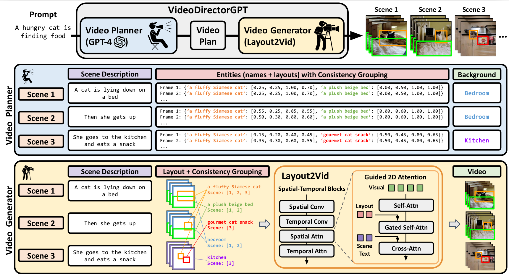
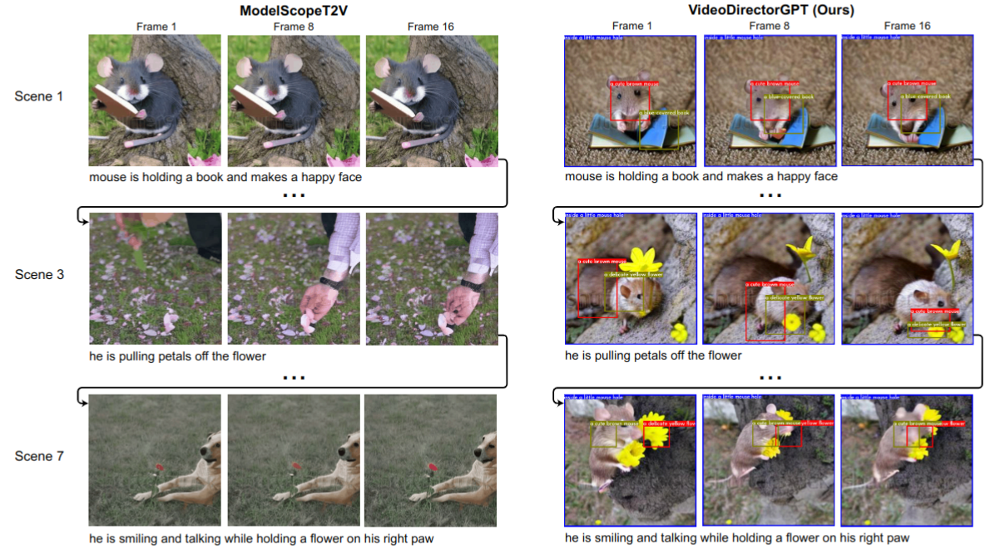
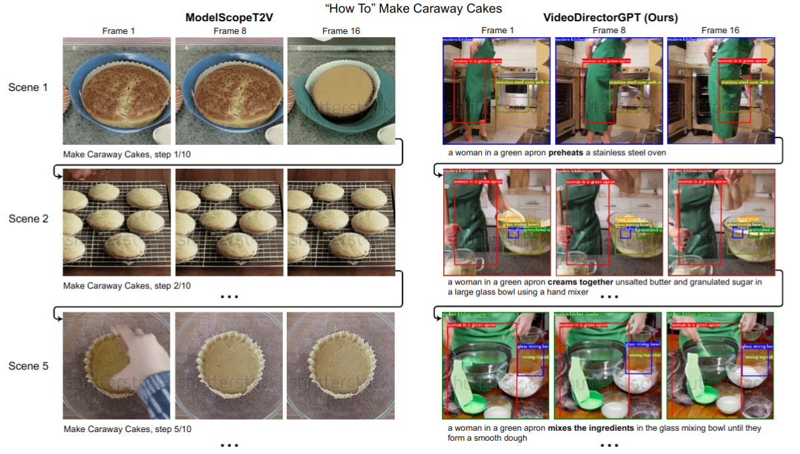
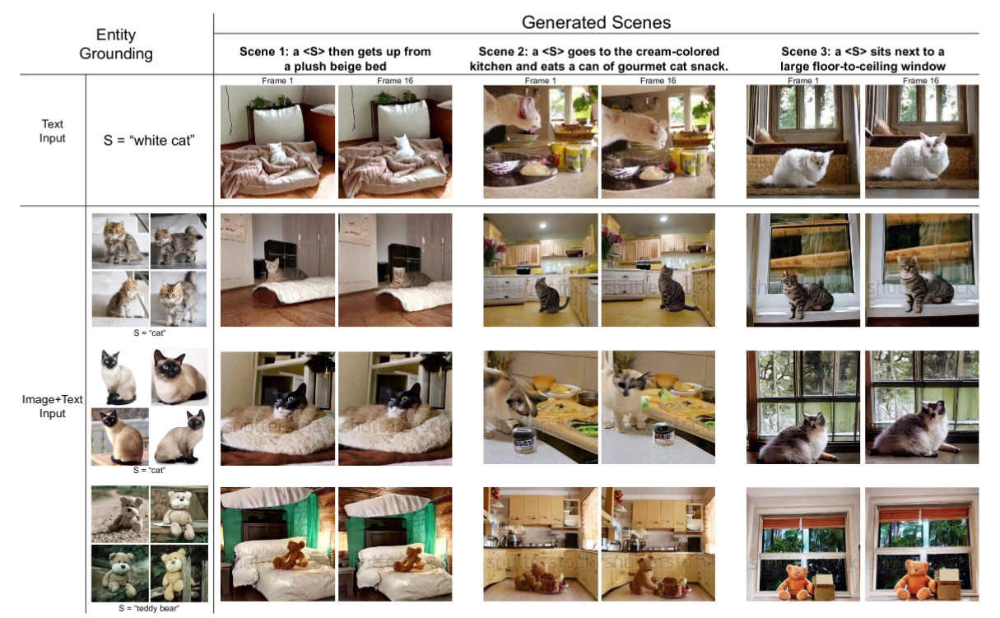

# VideoDirectorGPT: Consistent Multi-scene\\Video Generation via LLM-Guided Planning

Official implementatino of **VideoDirectorGPT**, a novel framework for consistent multi-scene video generation that uses the knowledge of LLMs for video content planning and grounded video generation.

**[Visual Programming for Text-to-Image Generation and Evaluation](https://vp-t2i.github.io/)**

[Han Lin](https://hl-hanlin.github.io/),
[Jaemin Cho](https://j-min.io),
[Abhay Zala](https://aszala.com/),
[Mohit Bansal](https://www.cs.unc.edu/~mbansal/)

[[Project Page](https://videodirectorgpt.github.io)]
[[Paper](https://arxiv.org/abs/2309.15091)]


<br>

<br>

Illustration of our two-stage framework for long, multi-scene video generation from text. In the first stage, we employ the LLM as a video planner to craft a video plan, which provides an overarching plot for videos with multiple scenes, guiding the downstream video generation process. The video plan consists of scene-level text descriptions, a list of the entities and background involved in each scene, frame-by-frame entity layouts (bounding boxes), and consistency groupings for entities and backgrounds. In the second stage, we utilize Layout2Vid, a grounded video generation module, to render videos based on the video plan generated in the first stage. This module uses the same image and text embeddings to represent identical entities and backgrounds from video plan, and allows for spatial control over entity layouts through the Guided 2D Attention in the spatial attention block.

<br>


# Generated Examples

<br>

<br>

Video generation examples on a Coref-SV prompt. Our video plan's object layouts (overlayed) can guide the Layout2Vid module to generate the same mouse and flower across scenes consistently, whereas ModelScopeT2V loses track of the mouse right after the first scene, generating a human hand and a dog instead of a mouse, and the flower changes color.


<br>

<br>

Comparison of generated videos on a HiREST prompt. Our model is able to generate a detailed video plan that properly expands the original text prompt to show the process, has accurate object bounding box locations (overlayed), and maintains the consistency of the person across the scenes. ModelScopeT2V only generates the final caraway cake and that cake is not consistent between scenes.


<br>

<br>

Video generation examples with custom entities. Users can flexibly provide either text-only (1st row) or image+text (2nd to 4th rows) descriptions to place custom entities when generating videos with VideoDirectorGPT. For both text and image+text based entity grounding examples, the identities of the provided entities are well preserved across multiple scenes


# Citation

If you find our project useful in your research, please cite the following paper:

```bibtex
@article{Lin2023VideoDirectorGPT,
        author = {Han Lin and Abhay Zala and Jaemin Cho and Mohit Bansal},
        title = {VideoDirectorGPT: Consistent Multi-Scene Video Generation via LLM-Guided Planning},
        year = {2023},
}
```